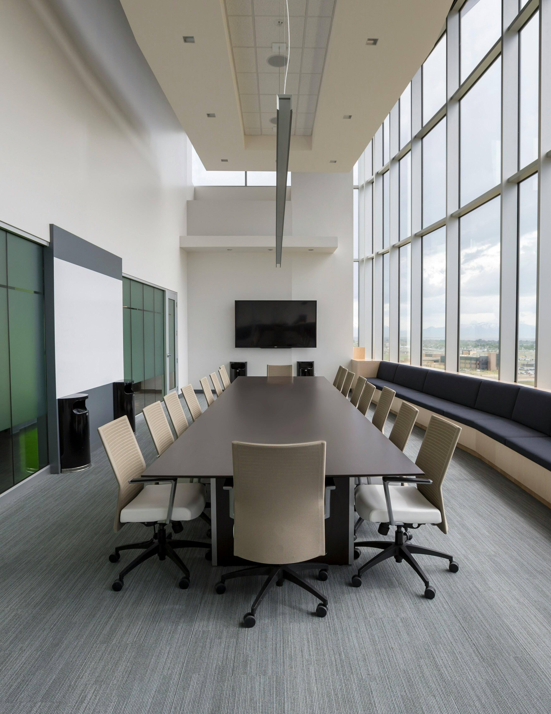
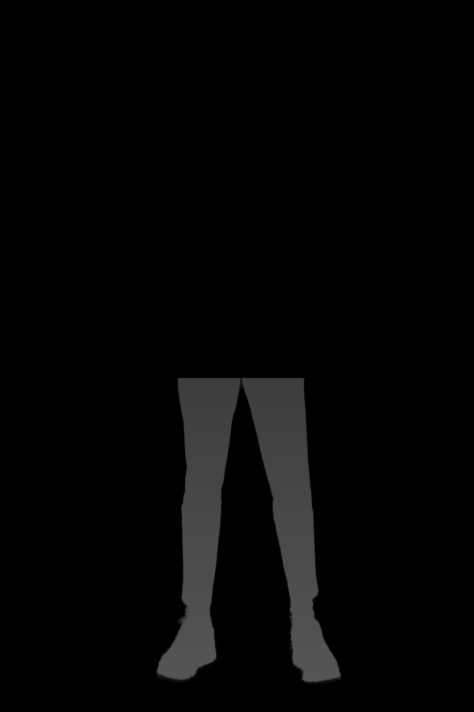

# Seamlessly Integrating a Person into a Scene

This project implements an algorithm to seamlessly integrate a person into any background scene with realistic lighting, shadows, and color harmonization. The implementation uses computer vision and image processing techniques to create a photorealistic composite.

## Algorithm Overview

The algorithm follows a systematic approach to create photorealistic composite images:

1. **Background Removal**: Extract the person from their original background using a deep learning-based segmentation model.
2. **Scene Analysis**: Analyze the target scene to understand lighting, depth, and shadows.
3. **Color Adaptation**: Adjust the person's colors to match the lighting conditions of the target scene.
4. **Shadow Generation**: Create realistic shadows based on the scene's lighting direction and depth.
5. **Perspective Matching**: Position the person in the scene with proper scaling and perspective.
6. **Final Integration**: Blend the person into the scene with realistic shadows and grunge textures.
7. **Color Grading**: Apply final adjustments for a cohesive, cinematic look.

## Results

Here are the results from the image integration process:

| Original Person | Original Scene | Final Composite |
|----------------|----------------|-----------------|
|  |  |  |

## Step-by-Step Process

### 1. Background Removal
Using the `rembg` library with U^2-Net for high-quality foreground extraction:


### 2. Scene Analysis
Analyzing scene depth and lighting conditions:


### 3. Color Matching
Matching the person's colors to the scene's lighting conditions:


### 4. Shadow Generation
Creating realistic shadows based on the scene's lighting direction:


### 5. Final Integration
Combining the person with the scene and adding final touches:


## Implementation Details

### Environment Setup
```
pip install opencv-python numpy scikit-image matplotlib pillow rembg
```

### Key Techniques Used

1. **Advanced Background Removal**: Using U^2-Net with alpha matting for clean edges.
2. **LAB Color Space Transformations**: For better color matching between the person and scene.
3. **Dynamic Shadow Generation**: Creating perspective-correct shadows that fade with distance.
4. **Perspective-Aware Placement**: Positioning the person with proper scaling based on scene depth.
5. **Color Grading**: Adding cinematic color adjustments to unify the composite.
6. **Grunge Texture**: Adding subtle texture to blend the person with the environment.

## Code Structure

- `main.py`: Main script that orchestrates the entire process
- `images/`: Input images (person and background)
- `masks/`: Generated masks for person and shadows
- `results/`: Output images from each stage
- `analysis/`: Analysis visualizations (depth map, lighting)

## Usage

1. Place the person image in `images/person.jpg`
2. Place the background image in `images/background.jpg`
3. Run the main script:
```
python main.py
```
4. Find the final output in `results/final_output.png`

## References

- [U^2-Net: Going Deeper with Nested U-Structure for Salient Object Detection](https://github.com/xuebinqin/U-2-Net)
- [Rembg: Remove image background](https://github.com/danielgatis/rembg)
- [OpenCV Documentation](https://docs.opencv.org/)
- [Scikit-image: Image processing in Python](https://scikit-image.org/)

## License

This project is licensed under the MIT License - see the LICENSE file for details.
